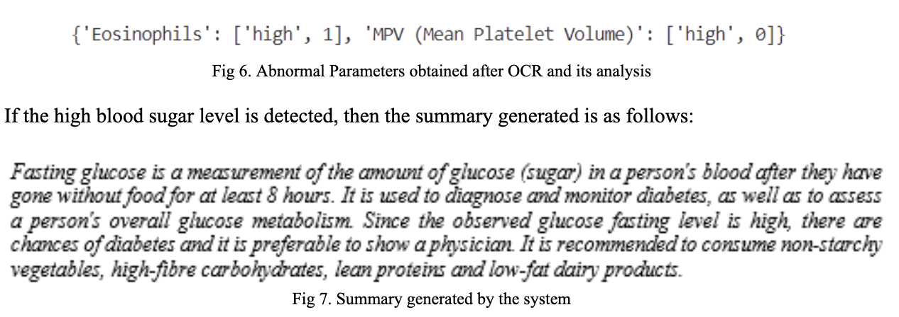

# <h1 align="center">CodeX Clinic (Website and App)</h1>

<h4 align="center"> Repository for CodeX Clinic project.</h4>

<h4 align="center">To watch our demo video. <a href="https://www.youtube.com/watch?v=74OVIPUa-dg">Click Here.</a></h4>

## Overview
**CodeX Clinic** is an AI-powered healthcare platform that offers medical report extraction and summarization using **AWS Textract** and **GPT-2**. The system efficiently extracts, processes, and summarizes medical reports, making it easier for patients to understand their health data without medical expertise.

## Features
### 🔹 **Medical Report Extraction & Summarization**
- Utilizes **AWS Textract** for Optical Character Recognition (OCR) to extract text from medical reports (PDF, JPG, PNG, BMP).
- Leverages **Natural Language Processing (NLP)** techniques to analyze extracted data.
- Summarizes key findings using **GPT-2**, presenting concise and comprehensible summaries.
- Provides **medical insights**, highlighting deficiencies or excess levels of medical parameters.

### 🔹 **User Dashboard**
- Easy-to-use dashboard for patients and doctors to upload, view, and manage medical reports.
- Displays extracted **abnormal parameters** with recommended actions.

### 🔹 **Doctor & Patient Interaction**
- Patients can search for doctors using multiple keywords.
- Booking system for **video consultations** and **in-person appointments**.
- Real-time **notifications** for scheduled appointments.

## Screenshots
#### **Login/Signup:**


#### **Dashboard:**


#### **Update Profile:**


#### **Search Doctors (Multiple Keywords):**


#### **Booking Appointment:**


#### **View Appointments:**


#### **Scheduled Appointments:**


#### **Multi-User Video Conference:**


#### **Notifications:**


#### **Medical Report Summary:**



## Technologies Used
### Backend:
- **Python (Flask, FastAPI)**
- **AWS Textract** (OCR Processing)
- **GPT-2** (Summarization)
- **PostgreSQL** (Database)

### Frontend:
- **React.js (Website)**
- **Flutter (Mobile App)**

### Other Tools & Libraries:
- **Pytesseract**, **EasyOCR**, **Pdfplumber** for OCR processing.
- **TensorFlow, Hugging Face Transformers** for NLP models.
- **Twilio API** for SMS/Email notifications.
- **WebRTC** for video conferencing.

## Setup & Installation
### Prerequisites:
- Python 3.8+
- Node.js 16+
- AWS Textract Account

### Backend Installation:
```bash
cd backend
pip install -r requirements.txt
python app.py
```

### Frontend Installation:
```bash
cd frontend
npm install
npm start
```

### Mobile App Installation:
```bash
cd mobile
flutter pub get
flutter run
```

## Contributing
We welcome contributions! Please fork the repository and submit a pull request.

## License
This project is licensed under the **MIT License**.

## Acknowledgments
Special thanks to **Pratik Kanani, Tanay Gandhi, Yash Jhaveri, and Varun Mehta** for their research on **Medical Report Summarization using Textract & GPT-2**.

---
🚀 **CodeX Clinic: AI-powered Healthcare for Everyone!**
